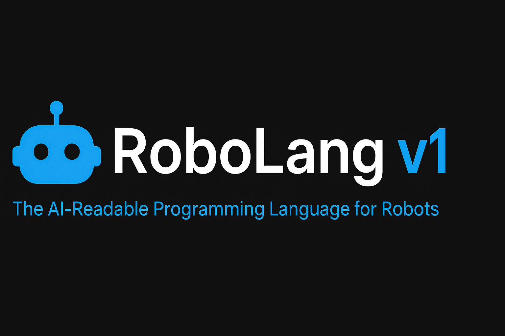

<p align="center">
  
  
  
  
  
</p>

<p align="center">
  <b>RoboLang</b> — An AI-readable domain-specific language for programming and coordinating robots.<br/>
  Built by <a href="https://github.com/rokorobot">@rokorobot</a>
</p>
<p align="center">
  
</p>

---

# 🤖 RoboLang v1 — The AI-Readable Programming Language for Robots

---

> **RoboLang** is a new domain-specific language (DSL) for robotic programming — readable by humans, executable by ROS2, and understandable by AI models.  
> It bridges natural language, LLM planning, and physical robot execution.

Created and maintained by **Robert Konecny (@rokorobot)**.

---

## 🧭 What Is RoboLang?

RoboLang defines a **universal task language** for robots.  
It allows engineers and AI systems to describe *what to do*, not *how to move each joint*.

### ✳️ Core Concepts
- **Declarative Syntax** — Simple, readable `task { plan { ... } }` structure.  
- **Safety Annotations** — Explicit `@safety` and `pre { ... }` sections for guard conditions.  
- **AI-Ready** — Designed for generation and reasoning by large language models (LLMs).  
- **ROS2 Integration** — Maps directly to MoveIt, GripperCommand, and custom services.  
- **Multi-Robot Collaboration** — Built-in `communicate` primitives for task handoffs.

---

## 🧩 Repository Contents

---

---

## 📂 Project Layout

```text
robolang/
├── src/
│   ├── robolang_adapter.py              # Simulated adapter (prints commands)
│   ├── robolang_adapter_ros2.py         # ROS2 adapter (connects to real robot actions/services)
│   ├── robolang_runtime.py              # Core RoboLang interpreter and executor
│   ├── robolang_ros2_main.py            # ROS2 runtime entrypoint (used by ros2 run)
│   └── __init__.py
│
├── stdlib/
│   └── robolang_std_v1.rob              # Standard library of RoboLang primitives and macros
│
├── examples/
│   ├── pick_and_place.rob               # Basic pick & place example
│   ├── inspect_object.rob               # Inspection task example
│   └── handover.rob                     # Multi-robot handover example
│
├── docs/
│   ├── RoboLang_v1_Ebook.pdf            # Complete language manual and exercises
│   ├── RoboLang_v1_Library_ROS2_Adapter.pdf # Library + ROS2 mapping documentation
│   ├── RoboLang_v1_Developer_Guide.pdf  # Developer setup and internal architecture
│   ├── RoboLang_v1_ROS2_Integration.pdf # Full ROS2 setup & hardware integration guide
│   ├── robolang_banner.png              # Project banner image for README
│   └── index.md                         # Documentation homepage for GitHub Pages
│
├── docker/
│   ├── Dockerfile                       # Environment container setup (Python + RoboLang)
│   └── docker-compose.yml               # Optional orchestrator for multi-robot simulation
│
├── README.md                            # Project overview and documentation
├── LICENSE                              # Apache 2.0 license
├── requirements.txt                     # Python dependencies (for local use)
└── setup.py                             # Package configuration + ROS2 entrypoint


```

## ⚙️ Getting Started

### 1. Prerequisites

- **Python 3.11+**
- **ROS2 Humble or newer**
- Optional: MoveIt2, Gazebo, FastAPI

### 2. Install RoboLang

```bash
git clone https://github.com/rokorobot/robolang.git
cd robolang
pip install -r requirements.txt
```

### 3. Run an Example

```bash
ros2 run robolang runtime examples/pick_and_place.rob
```

or directly with Python:

```bash
python3 src/robolang_runtime.py examples/pick_and_place.rob
```

---

## 🧠 Core Components

| Component | Description |
|------------|--------------|
| `RoboLang DSL` | The language syntax defining `task`, `pre`, `plan`, and `@safety`. |
| `robolang_std_v1.rob` | The standard library with reusable actions like `pick_and_place`, `inspect_object`, etc. |
| `robolang_adapter.py` | Maps RoboLang actions to ROS2 entities (MoveIt, GripperCommand, etc). |
| `robolang_runtime.py` | Minimal interpreter that parses `.rob` files and executes them via the adapter. |

---

## 📘 Documentation

| Guide | Description |
|-------|--------------|
| [RoboLang v1 Language Manual (PDF)](docs/RoboLang_v1_Ebook.pdf) | Learn the syntax and semantics of RoboLang. |
| [Standard Library + ROS2 Adapter (PDF)](docs/RoboLang_v1_Library_ROS2_Adapter.pdf) | Ready-to-use task definitions and ROS2 mapping guide. |
| [Developer Guide (PDF)](docs/RoboLang_v1_Developer_Guide.pdf) | Build and deploy the RoboLang runtime interpreter. |
| [ROS2 Integration & Hardware Setup (PDF)](docs/RoboLang_v1_ROS2_Integration.pdf) | Step-by-step guide for deploying RoboLang on real robots and ROS2 environments. |


---

## 🧠 Example RoboLang Task

```rob
task pick_and_place(robot r, object box, location src, location dst, region cell) {
    @safety max_speed 0.5;
    pre {
        robot_ready r;
        region_clear cell;
    }
    plan {
        move r to src;
        grasp r box;
        move r to dst;
        place r box at dst;
        communicate r to "fleet" with "TASK_COMPLETE";
    }
}
```

---

## 🛰️ Integration Architecture

```
[ Human / AI Prompt ]
          ↓
[ LLM Planner ] → RoboLang Task (.rob)
          ↓
[ Runtime Interpreter (Python) ]
          ↓
[ ROS2 Adapter → MoveIt, GripperCommand, Custom Services ]
          ↓
[ Real Robot or Simulation ]
```

---

## 🧩 Roadmap

| Version | Focus |
|----------|-------|
| v1.0.0 | Language, Library, ROS2 Adapter |
| v1.1.0 | Full Grammar Parser, Unit Tests |
| v1.2.0 | LLM-Driven Task Planner Integration |
| v2.0.0 | Multi-Robot Runtime, Safety Simulation |

---

## 🧑‍💻 Contributing

Pull requests are welcome!  
Please follow PEP8 for Python code, and use the `.rob` examples in `/stdlib` as reference style.

### To contribute:

```bash
git checkout -b feature/your-feature
git commit -am "Add new library task"
git push origin feature/your-feature
```

Then open a pull request on GitHub.

---

## 📄 License

Licensed under the **Apache License 2.0**.  
You’re free to use, modify, and distribute RoboLang in open or commercial robotics projects.

---

## 🌍 Links & Resources

- 📘 [Official Docs](https://rokorobot.github.io/robolang)
- 💬 [Discussion Board](https://github.com/rokorobot/robolang/discussions)
- 🐳 [Docker Image (coming soon)](https://hub.docker.com/r/rokorobot/robolang)
- 🤖 [ROS Index Listing](https://index.ros.org/p/robolang/)
- 🧠 [Hugging Face Space for LLM Integration (planned)](https://huggingface.co/spaces/rokorobot/robolang)

---

### 🦾 *RoboLang is to robots what Python was to software.*

Bridging human intent and machine execution — safely, clearly, and universally.

---

## 🧪 Run the Demo

RoboLang comes with a ready-to-run **simulated pick-and-place example** — no ROS2 required.

### 1️⃣ Prerequisites
- **Python 3.11+** (tested successfully on Python 3.13)
- **Git**

### 2️⃣ Clone the repository
```bash
git clone https://github.com/rokorobot/RoboLang.git
cd RoboLang
```

### 3️⃣ Run the demo

Use Python to execute the RoboLang runtime with the included .rob example:
```bash
python src/robolang_runtime.py examples/pick_and_place.rob
```
### 4️⃣ Expected output
[RUNTIME] executing: move r to src;

[MOVE] robot_arm_1 → joints=[0.0, -1.0, 1.0, 0.0, 1.0, 0.0] (duration=2.0s)

[RUNTIME] executing: grasp r box;

[GRIPPER] robot_arm_1 → CLOSE (position=1.0, max_effort=50.0)

[RUNTIME] executing: move r to dst;

[MOVE] robot_arm_1 → joints=[0.0, -1.0, 1.0, 0.0, 1.0, 0.0] (duration=2.0s)

[RUNTIME] executing: place r box at dst;

[GRIPPER] robot_arm_1 → OPEN (position=0.0, max_effort=50.0)

[RUNTIME] executing: communicate r to "fleet" with "TASK_COMPLETE";

[COMM] robot_arm_1@fleet → TASK_COMPLETE

If you see this output — congratulations 🎉
Your RoboLang v1 runtime and simulated adapter are working!

🧩 What this demo does

Parses a .rob task file (examples/pick_and_place.rob)

Interprets the plan { ... } block

Calls RobotAdapter primitives:

move_to_pose()

set_gripper()

communicate()

Simulates robot motion and communication in the terminal

---

## 🦾 Connecting RoboLang to Real Robots (ROS2 Integration)

RoboLang is fully compatible with **ROS2-based robotic systems**.  
This allows tasks written in `.rob` format to be executed on **real robot hardware** running ROS2.

---

### 🧭 Architecture Overview

| Layer | Purpose | Runs On | Example Files |
|-------|----------|----------|----------------|
| **Language / Runtime** | Parses `.rob` task files, runs logic flow | Any OS (Windows, macOS, Linux) | `src/robolang_runtime.py`, `examples/` |
| **Simulated Adapter** | Prints fake actions for quick testing | Any OS | `src/robolang_adapter.py` |
| **ROS2 Adapter** | Sends real ROS2 actions & topics | **Robot / ROS2 Host (Linux)** | `src/robolang_adapter_ros2.py` |
| **ROS2 Entrypoint** | Runs RoboLang runtime inside a ROS2 node | **Robot / ROS2 Host (Linux)** | `src/robolang_ros2_main.py` |

---

### ⚙️ Setup on the Robot’s ROS2 Machine

These steps must be done on the **robot controller or any Ubuntu 22.04 machine with ROS2 Humble or Iron installed**.

1. **Open a terminal on the ROS2 system:**
   ```bash
   cd ~/ros2_ws/src
2. Clone the RoboLang repository:
   ```bash
   git clone https://github.com/rokorobot/RoboLang.git robolang
3. Add a minimal package.xml if not present:
   ```bash
   <?xml version="1.0"?>
   <package format="3">
    <name>robolang</name>
    <version>1.0.0</version>
    <description>RoboLang — AI-readable DSL for robots using ROS2</description>
    <maintainer email="rokorobot@users.noreply.github.com">Robert Konecny</maintainer>
    <license>Apache-2.0</license>
    <exec_depend>rclpy</exec_depend>
    <exec_depend>control_msgs</exec_depend>
    <exec_depend>trajectory_msgs</exec_depend>
    <exec_depend>std_msgs</exec_depend>
   </package>
   ```
4. Build the workspace:
   ```bash
   cd ~/ros2_ws
   colcon build
   source install/setup.bash
5. Run a RoboLang task inside ROS2:
   ```bash
   ros2 run robolang ros2_runtime examples/pick_and_place.rob
If your robot’s ROS2 action servers are active (e.g. /arm_controller/follow_joint_trajectory and /gripper_controller/gripper_action), RoboLang will send real commands to move the robot arm, grasp objects, and perform communications.

🧩 Supported ROS2 Actions (v1)
| RoboLang Command                                | ROS2 Mapping                           | Message Type                                |
| ----------------------------------------------- | -------------------------------------- | ------------------------------------------- |
| `move r to X`                                   | `FollowJointTrajectory`                | `control_msgs/action/FollowJointTrajectory` |
| `grasp r object`                                | `GripperCommand`                       | `control_msgs/action/GripperCommand`        |
| `place r object at dst`                         | `GripperCommand (open)`                | `control_msgs/action/GripperCommand`        |
| `inspect r object`                              | Custom service (e.g. `/sensor_status`) | `my_msgs/srv/SensorStatus`                  |
| `communicate r to "fleet" with "TASK_COMPLETE"` | Topic publish                          | `std_msgs/msg/String`                       |

🧪 Testing Safely in Simulation

Before connecting to real hardware, you can test RoboLang inside:

🧠 Gazebo Sim (with your arm model + MoveIt2)

🧩 ROS2 Dummy Action Servers

💻 Headless test that simply confirms goal publishing and topic messages

⚠️ Hardware Safety Notice

RoboLang is designed for structured, safe task execution — but it does not override your robot’s safety system.
Before running on real hardware:

Confirm joint limits and velocity limits are respected

Validate every command in simulation first

Use @safety annotations in your .rob tasks to define constraints

🌐 Architecture Recap

┌─────────────────────┐

│  ------- Developer (PC)  ..---------...          │

│  ------- Edits .rob files   ..----------...      │

│  ------- Commits to GitHub  ..----...      │

└─────────┬───────────┘

                  │
          
                  ▼
          
┌─────────────────────┐

│ ---- ROS2 Host / Robot ------- ....       │

│  ---- Pulls from GitHub --------  ....    │

│  ---- Runs ROS2 adapter ------- ....     │

│  ---- Executes actions  ---------- ....     │

└─────────────────────┘

This section defines exactly what parts of RoboLang must run on robotic hardware versus your development environment.


